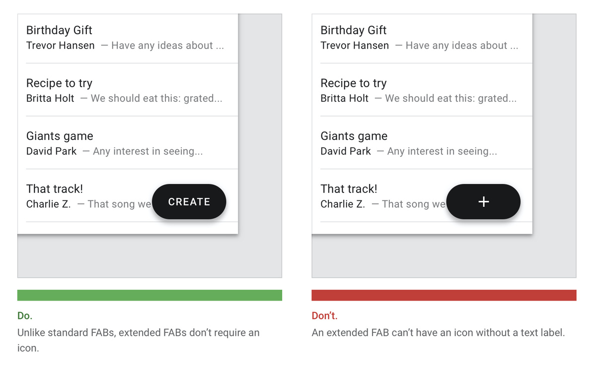
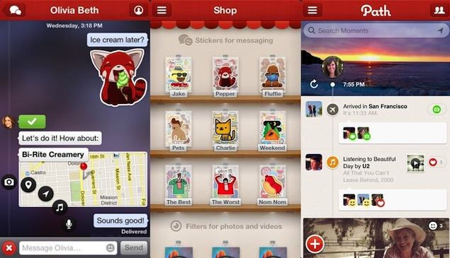
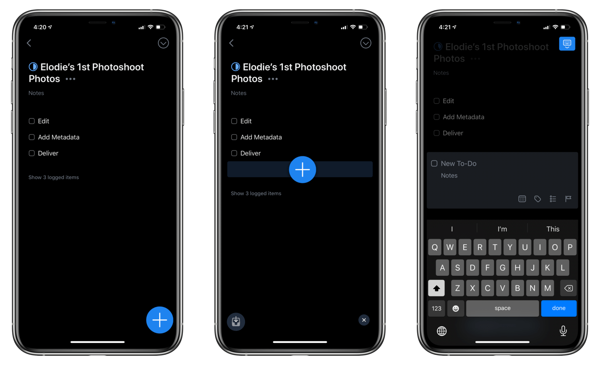
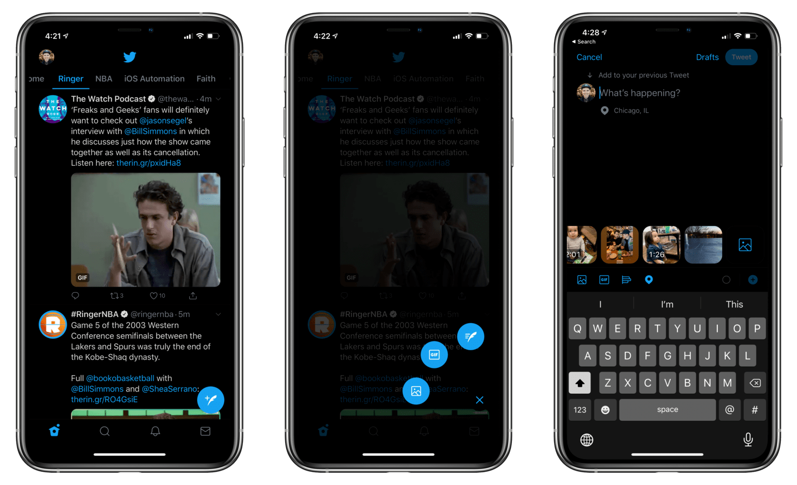

I’ve always found Apple’s iOS User Interface ethos a bit odd. When you read Apple’s iOS [Human Interface Guidelines](https://developer.apple.com/design/human-interface-guidelines/ios/overview/themes/), it feels sparse. The HIG is supposed to be the complete documentation for designers and developers to ensure the quality of the apps on Apple’s platforms, but it ignores many common UI elements. Elements like hamburger menus, side panels, cards, or floating action buttons, aren’t discouraged or even mentioned. Many apps use these UI elements, and it seems that [Apple doesn’t like it](https://twitter.com/themikestern/status/997531721208807424?s=21), but won’t reject the app for their use. It pains me to say that Google’s [Material Design documentation](https://material.io/components/buttons-floating-action-button/#) is superior to Apple’s HIG documentation in nearly every way. It’s much more complete and offers many more examples for how UI elements should be used. That said, I find Android apps to be at best, lightly designed carbon copies and at worst, boring, listless, barely designed apps that are far from enjoyable to use.

<figcaption>One of Google's Material Design guidelines for using FABs.</figcaption>

The first time that I noticed a floating action button (also known as a FAB) was in the very influential, but long discontinued [Path app](https://en.wikipedia.org/wiki/Path_(social_network)). The app had this very clever, small FAB in the bottom left of the app that when tapped delightfully animated and allowed you to choose which kind of content you wanted to add to the social network. I was certain this was going to be the UI that nearly all designers and developers would be adopting in the coming years. [I was very wrong](https://thenextweb.com/dd/2011/12/04/look-out-tab-bar-get-ready-for-paths-sharing-ui-to-be-everywhere/). I don't think I saw a popular implementation of them again until Google's Material Design which debuted in 2014. It dawned on me recently though that many of my favorite apps have begun to rely on this design pattern.

<figcaption>Now discontinued social app Path.</figcaption>

Whenever you see several people solving the same problem in a similar kind of way it's important to decide whether it's a trend or a solution with real substance. I don't think that FABs are a trend. They're a very reliable, solid user interface element that many apps should consider using.

## What Are They Best Used For?

The main way that I've found that FABs are used is for adding content to an app. It could be adding a task to a project, adding a new calendar event, or Tweeting your thoughts. It's also commonly used as filtering or sorting data like on a map or list view, but primarily it's a UI for adding to an app.

## Why Should Designers/Developers Use FABs?

### Multiple Actions

In most cases, tapping the button reveals a view to add your content, but it's also used to have that tap reveal secondary options for adding content. The Path app implemented this functionality so well. [RIP Path](https://path.com/goodbye). In Things 3, you can drag the FAB (called the [Magic Plus](https://culturedcode.com/things/whats-new/)) to create a new task or project in varies places around the app. I use this constantly. It's much more satisfying than having to tap through a list or table to organize a task or project. In the Twitter app, 3D touching or long pressing reveals the ability to add text, image, or a gif to start a tweet. This is similar to the way that iOS does it's contextual menus in springboard. It feels like a natural next step.

<figcaption>Things 3's "Magic Plus" allows you to create a new todo item or new project.</figcaption>

<figcaption>Twitter's tweet FAB allows text, image, and GIF options.</figcaption>

### Finger Reachability

The most common location for a FAB is in the bottom right part of the phone. For a person using their phone right handed, this is in a slightly uncomfortable position. For someone using their phone left handed, or with two hands, it is a very comfortable position to tap. I find the bottom right position, using either hand, to be comfortable in most situations, although I understand how it could be difficult for some. The other option, which many apps choose, is to add a plus in the top right of the tab bar (like you see in Apple's Calendar app). This position requires quite a bit of stretch using either hand and is a much smaller target to tap.

### Clarity of Action

When a user opens an app the options for what to do need to be very clear. Buttons, tabs, actions, etc. all should be either obvious or easily learned behaviors. FABs are often the primary button color of the app and hang out in the same area regardless of state. This anchors the user to know what to do and where to tap to preform an action. Because Android and Google’s iOS apps have them as a common UI element, I can imagine it's users know intuitively how to add content since so many apps have a similar UI.

## Apps using FABs

I went through nearly every app on my phone and these are some of my favorite apps using FABs in their app.

- Things 3
- Fantastical 3
- Twitter
- Airbnb
- Transit
- Scanner Pro
- Spark 3
- Adobe Lightroom CC
- Nearly all Google apps (including Drive, Maps, Calendar, Voice, etc.)
- Trip Advisor
- Toggl
- Apple's Notes app

Floating action buttons seem to be having a moment on iOS, and it's time for more Apple developers to embrace them. If you're a designer or developer, consider them as an option for your UI. You might be surprised at how pleasantly it solves your UI problems.
